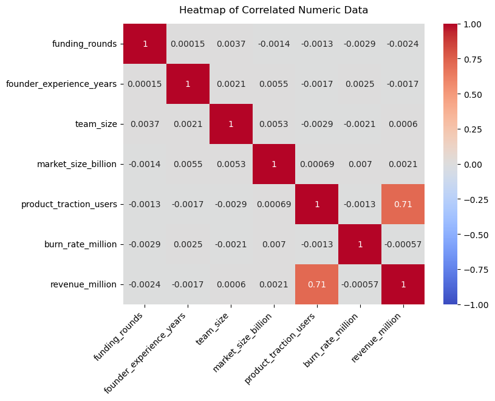
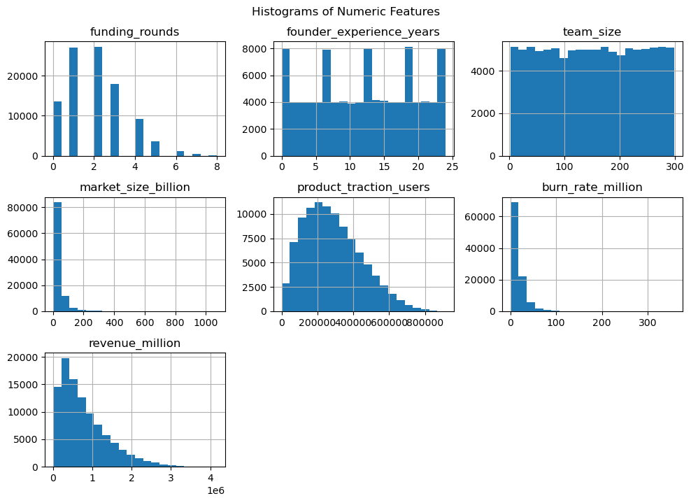
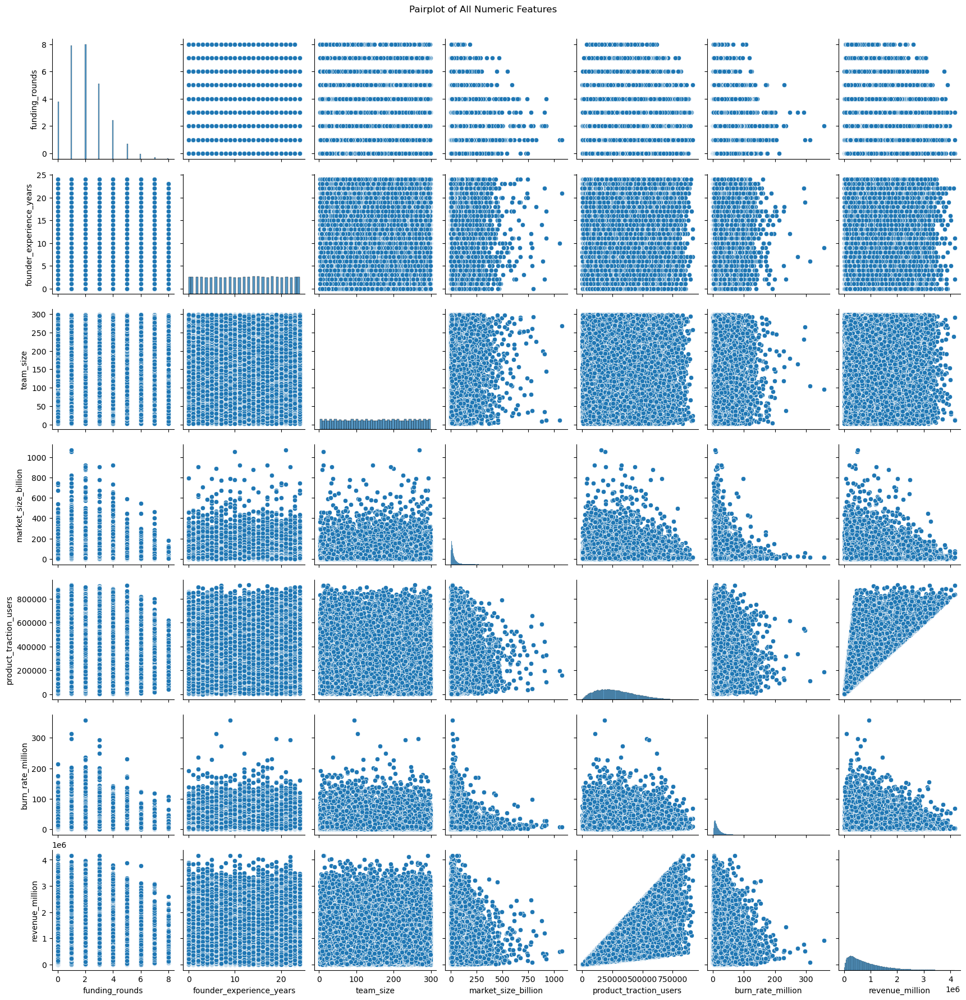
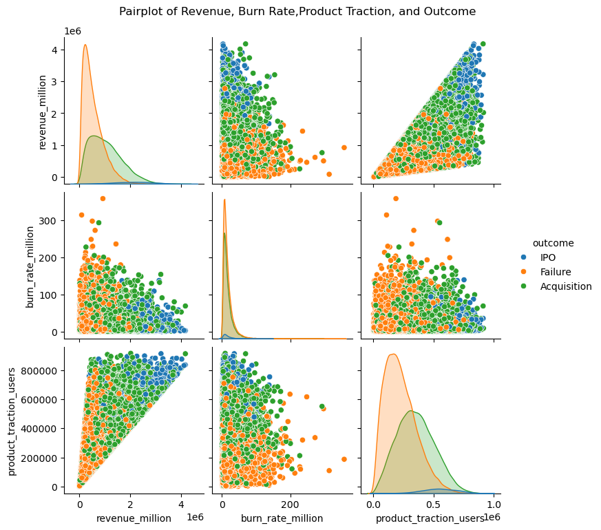
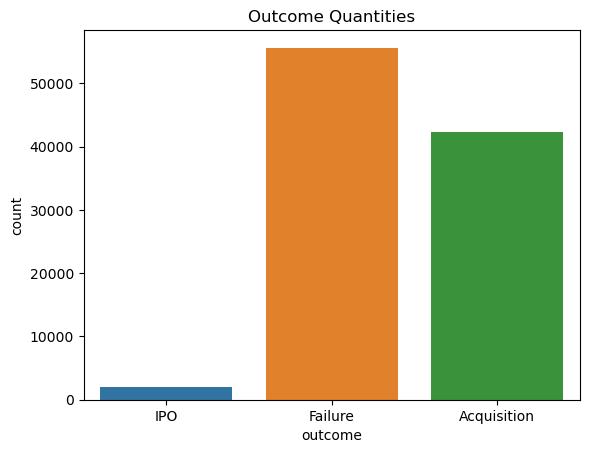
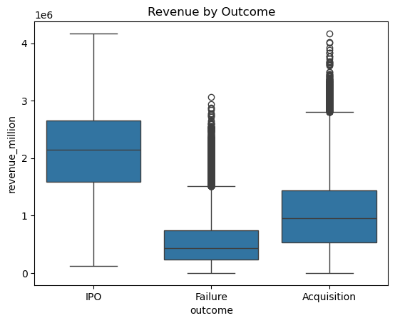
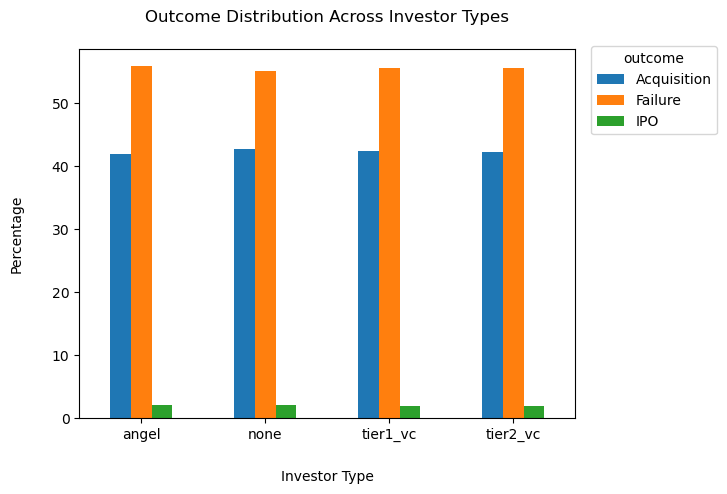
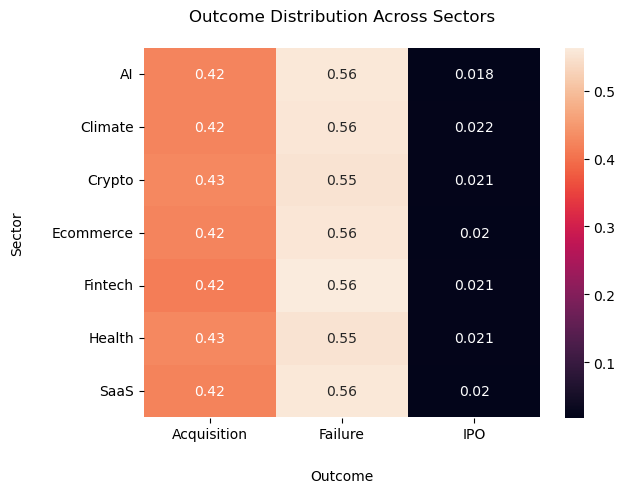
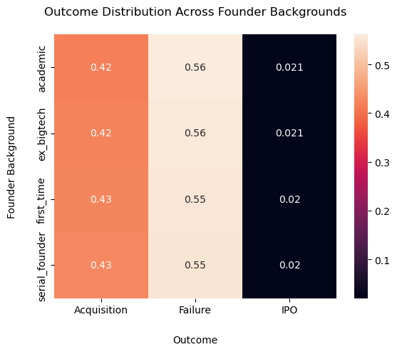
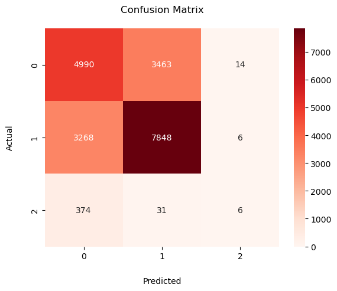

# Business Understanding

## Problem Statement
The goal of this project is to develop a machine learning model capable of identifying the smallest set of features that can reliably predict whether an early-stage startup will succeed or fail. Additionally, the project will explore how combinations of factors influence the startup's growth and long-term performance.

## Business Objectives

### Background
Few startups rapidly scale into successful businesses, while many others fail due to factors like poor market fit, insufficient funding, lack of product traction, etc. Investors, founders, and analysts often rely on typical benchmarks, historical records of success, and experience to evaluate a startup's potential. However, these methods may overlook some complex relationships hidden within the data.

This project will explore whether machine learning can be used to identify the most common and key patterns associated with startup success or failure.

The dataset contains startup-related information such as funding rounds, team size, market potential, revenue, investory type, and more.

### Objectives
The primary business objective is to use the above factors in building predictive models that estimate the likelihood of success.

Secondary objectives include:
* Identifying which startup features have the strongest influence on success
* Understand how feature combinations influce startup outcomes
* Provide investors and analysts with a more data-driven approach to evaluating the potential of a startup


## Business Success Criteria

The project will be considered successful if the final machine learning model successfully predicts outcomes with reasonable reliability.

Additional success criteria include:
* The development of multiple models to compare and determine which approach performs best
* Producing interpretable results identifying which features contributed most to the prediction
* Demonstrating that machine learning can evaluate startups and support decision-making processes for investors, founders, and analysts

## Situational & Data Assessment

### Resources
The following resources will be used in this project:
* Business and financial information from startups
* Python programming language
* Jupyter Notebook dev environment
* Data science libraries including pandas, NumPy, matplotlib, seaborn, and scikit-learn
* ML algorithms and models such as Logistic Regression, Regularization, and Decision Trees

### Assumptions & Constraints
#### Assumptions:
1. The dataset accurately represents real startup business data
2. The labeled outcomes correctly identify success or failure
3. The dataset contains enough information to support early-stage startup predictions

#### Constraints
1. The project is currently limited to the data provided in the dataset. Additional sourced data is out of scope.
2. Computational limitations may reduce the ability to test highly complex models
3. There may be a large number of missing or unusable values in the dataset

### Risks and Contingencies
1. The dataset may contain a large number of missing, incomplete, or unusable values
2. Success or failure may actually be influenced by factors not included in the dataset


# Exploratory Data Analysis


```python
import pandas as pd
import matplotlib.pyplot as plt
import seaborn as sns
import numpy as np
import plotly.express as px
from sklearn.model_selection import train_test_split
from sklearn.linear_model import LinearRegression
from sklearn.linear_model import LogisticRegression
from sklearn.metrics import mean_squared_error, r2_score
from sklearn.metrics import accuracy_score
from sklearn.metrics import classification_report, confusion_matrix
from sklearn.preprocessing import LabelEncoder
from sklearn.preprocessing import StandardScaler
```


```python
# Load the dataset
data = pd.read_csv('data/startup_success_dataset.csv')
```


```python
# Display the first few rows of the dataset to understand its structure
data.head()
```


<div>
<style scoped>
    .dataframe tbody tr th:only-of-type {
        vertical-align: middle;
    }

    .dataframe tbody tr th {
        vertical-align: top;
    }

    .dataframe thead th {
        text-align: right;
    }
</style>
<table border="1" class="dataframe">
  <thead>
    <tr style="text-align: right;">
      <th></th>
      <th>funding_rounds</th>
      <th>founder_experience_years</th>
      <th>team_size</th>
      <th>market_size_billion</th>
      <th>product_traction_users</th>
      <th>burn_rate_million</th>
      <th>revenue_million</th>
      <th>investor_type</th>
      <th>sector</th>
      <th>founder_background</th>
      <th>outcome</th>
    </tr>
  </thead>
  <tbody>
    <tr>
      <th>0</th>
      <td>4</td>
      <td>13</td>
      <td>58</td>
      <td>48.225483</td>
      <td>594843</td>
      <td>18.519211</td>
      <td>1.483962e+06</td>
      <td>tier2_vc</td>
      <td>Health</td>
      <td>academic</td>
      <td>IPO</td>
    </tr>
    <tr>
      <th>1</th>
      <td>1</td>
      <td>6</td>
      <td>221</td>
      <td>31.532647</td>
      <td>393020</td>
      <td>14.298149</td>
      <td>8.620568e+05</td>
      <td>tier2_vc</td>
      <td>Fintech</td>
      <td>first_time</td>
      <td>Failure</td>
    </tr>
    <tr>
      <th>2</th>
      <td>3</td>
      <td>5</td>
      <td>247</td>
      <td>4.969722</td>
      <td>27636</td>
      <td>20.447567</td>
      <td>9.726169e+04</td>
      <td>none</td>
      <td>SaaS</td>
      <td>first_time</td>
      <td>Failure</td>
    </tr>
    <tr>
      <th>3</th>
      <td>3</td>
      <td>14</td>
      <td>229</td>
      <td>3.084209</td>
      <td>235376</td>
      <td>8.177417</td>
      <td>1.145785e+06</td>
      <td>none</td>
      <td>Ecommerce</td>
      <td>ex_bigtech</td>
      <td>Acquisition</td>
    </tr>
    <tr>
      <th>4</th>
      <td>1</td>
      <td>17</td>
      <td>235</td>
      <td>13.818188</td>
      <td>391765</td>
      <td>4.879792</td>
      <td>8.608949e+05</td>
      <td>none</td>
      <td>Health</td>
      <td>first_time</td>
      <td>Acquisition</td>
    </tr>
  </tbody>
</table>
</div>


```python
# Display the shape of the dataset to better understand the number of samples and features
shape = data.shape
print(f"Rows:{shape[0]} \nColumns: {shape[1]}")
```

    Rows:100000 
    Columns: 11


```python
# Display a summary of the dataset to understand its data types and identify any missing values
data.info()
```

    <class 'pandas.core.frame.DataFrame'>
    RangeIndex: 100000 entries, 0 to 99999
    Data columns (total 11 columns):
     #   Column                    Non-Null Count   Dtype  
    ---  ------                    --------------   -----  
     0   funding_rounds            100000 non-null  int64  
     1   founder_experience_years  100000 non-null  int64  
     2   team_size                 100000 non-null  int64  
     3   market_size_billion       100000 non-null  float64
     4   product_traction_users    100000 non-null  int64  
     5   burn_rate_million         100000 non-null  float64
     6   revenue_million           100000 non-null  float64
     7   investor_type             100000 non-null  object 
     8   sector                    100000 non-null  object 
     9   founder_background        100000 non-null  object 
     10  outcome                   100000 non-null  object 
    dtypes: float64(3), int64(4), object(4)
    memory usage: 8.4+ MB


```python
# Display basic statistical details to understand numerical distributions.
data.describe()
```


<div>
<style scoped>
    .dataframe tbody tr th:only-of-type {
        vertical-align: middle;
    }

    .dataframe tbody tr th {
        vertical-align: top;
    }

    .dataframe thead th {
        text-align: right;
    }
</style>
<table border="1" class="dataframe">
  <thead>
    <tr style="text-align: right;">
      <th></th>
      <th>funding_rounds</th>
      <th>founder_experience_years</th>
      <th>team_size</th>
      <th>market_size_billion</th>
      <th>product_traction_users</th>
      <th>burn_rate_million</th>
      <th>revenue_million</th>
    </tr>
  </thead>
  <tbody>
    <tr>
      <th>count</th>
      <td>100000.000000</td>
      <td>100000.000000</td>
      <td>100000.000000</td>
      <td>100000.000000</td>
      <td>100000.000000</td>
      <td>100000.000000</td>
      <td>1.000000e+05</td>
    </tr>
    <tr>
      <th>mean</th>
      <td>2.002300</td>
      <td>12.024300</td>
      <td>150.732000</td>
      <td>33.203875</td>
      <td>285422.832730</td>
      <td>16.776213</td>
      <td>7.828191e+05</td>
    </tr>
    <tr>
      <th>std</th>
      <td>1.414671</td>
      <td>7.208089</td>
      <td>86.272631</td>
      <td>43.034753</td>
      <td>159323.885405</td>
      <td>15.711368</td>
      <td>6.085069e+05</td>
    </tr>
    <tr>
      <th>min</th>
      <td>0.000000</td>
      <td>0.000000</td>
      <td>2.000000</td>
      <td>0.288738</td>
      <td>668.000000</td>
      <td>0.279763</td>
      <td>1.344810e+03</td>
    </tr>
    <tr>
      <th>25%</th>
      <td>1.000000</td>
      <td>6.000000</td>
      <td>76.000000</td>
      <td>10.196778</td>
      <td>161194.750000</td>
      <td>7.087591</td>
      <td>3.154861e+05</td>
    </tr>
    <tr>
      <th>50%</th>
      <td>2.000000</td>
      <td>12.000000</td>
      <td>151.000000</td>
      <td>20.158063</td>
      <td>264989.500000</td>
      <td>12.169059</td>
      <td>6.213624e+05</td>
    </tr>
    <tr>
      <th>75%</th>
      <td>3.000000</td>
      <td>18.000000</td>
      <td>226.000000</td>
      <td>39.531967</td>
      <td>389214.000000</td>
      <td>20.953561</td>
      <td>1.098921e+06</td>
    </tr>
    <tr>
      <th>max</th>
      <td>8.000000</td>
      <td>24.000000</td>
      <td>299.000000</td>
      <td>1072.434476</td>
      <td>915203.000000</td>
      <td>357.491454</td>
      <td>4.168443e+06</td>
    </tr>
  </tbody>
</table>
</div>


```python
# Display basic statistical details to understand categorical distributions.
data.describe(include = 'object')
```


<div>
<style scoped>
    .dataframe tbody tr th:only-of-type {
        vertical-align: middle;
    }

    .dataframe tbody tr th {
        vertical-align: top;
    }

    .dataframe thead th {
        text-align: right;
    }
</style>
<table border="1" class="dataframe">
  <thead>
    <tr style="text-align: right;">
      <th></th>
      <th>investor_type</th>
      <th>sector</th>
      <th>founder_background</th>
      <th>outcome</th>
    </tr>
  </thead>
  <tbody>
    <tr>
      <th>count</th>
      <td>100000</td>
      <td>100000</td>
      <td>100000</td>
      <td>100000</td>
    </tr>
    <tr>
      <th>unique</th>
      <td>4</td>
      <td>7</td>
      <td>4</td>
      <td>3</td>
    </tr>
    <tr>
      <th>top</th>
      <td>tier2_vc</td>
      <td>Crypto</td>
      <td>first_time</td>
      <td>Failure</td>
    </tr>
    <tr>
      <th>freq</th>
      <td>35327</td>
      <td>14456</td>
      <td>39980</td>
      <td>55610</td>
    </tr>
  </tbody>
</table>
</div>


```python
# Display a heatmap of all data with numeric values to visualize their correlations before the data is cleaned.

# Store the numeric data in a variable
data_numeric = data.select_dtypes(include = ['int64', 'float64'])

# Set the plot size, settings, and title.
plt.figure(figsize = (8, 6))
sns.heatmap(data_numeric.corr(), annot = True, cmap = 'coolwarm', vmin = -1, vmax = 1)
plt.xticks(rotation=45, ha='right')
plt.title('Heatmap of Correlated Numeric Data', y = 1.02)
plt.show()
```


    

    


The heatmap reveals that product_traction_users and revenue_million are highly correlated. This appears to be the strongest numeric correlation in the raw dataset.
However, all other numeric correlations appear near 0. This could mean highly synthetic data, or the relationships are nonlinear.

Based on this data, it may be beneficial to utilize _revenue_million_ and _product_traction_users_ in the initial model.
Additionally, a Decision Tree may find strong nonlinear patterns where the numeric correlation heatmap did not.


```python
# Display a histogram matrix to quickly identify outliers and skewed data
data_numeric.hist(figsize = (10, 7), bins = 20)
plt.tight_layout()
plt.suptitle('Histograms of Numeric Features', y = 1.02)
plt.show()
```


    

    


Several feeatures exhibit a right-skewed histogram. This likely indicates that scaling will be necessary later.

Additionally, features like _founder_experience_years_ and _team_size_ display unusually consistnt spikes and uniformity. This potentially means synthetic data.

_market_size_billion_ has a high quantitative value of startups operating in unusually large markets. This potentially indicates outliers.


```python
# Pair plot of all numeric features, visualizing their relationships and distributions.
sns.pairplot(data)
plt.suptitle('Pairplot of All Numeric Features', y = 1.02)
plt.show()
```


    

    


Based on the pairplot above, four features appear to have an identifiable correlation with the revenue factor, which was previously identified as a potential strong influence in startup outcome. These features include _funding_rounds_, _market_size_billion_, _product_traction_users_, and _burn_rate_million_.


```python

#Pair plot of the selected features
sns.pairplot(data[['revenue_million', 'burn_rate_million', 'product_traction_users', 'outcome']], hue = 'outcome')
plt.suptitle('Pairplot of Revenue, Burn Rate,Product Traction, and Outcome', y = 1.02)
plt.show()
```


    

    


Pair plots revealed a strong relationship between product traction and revenue across startup outcomes. Additionally, companies that reached IPO status generally exhibited the highest user traction and highest revenues. Contrary, failed startups typically had the lowest revenue and user count.

Furthermore, burn rate revealed a strong relationship with revenue and product traction. The data suggests that startups with higher burn rates had lower overall revenue and product traction.

Since revenue also demonstrates a strong relationship with startup outcomes, these features may indirectly contribute to predicting outcome classifications. Further analysis and modeling will help determine the strength and significance of these relationships.

Finally, the plot demonstrates clear outliers that may require cleaning before modeling.


```python
# Explore the target variable
data['outcome'].value_counts()

# Visualize outcome quantities
sns.countplot(data = data, x = 'outcome', hue = 'outcome')
plt.title('Outcome Quantities')
plt.show()
```


    

    


```python
# Visualize an outcome boxplot
sns.boxplot(data, x = 'outcome', y = 'revenue_million')
plt.title('Revenue by Outcome')
plt.show()
```


    

    


This boxplots confirms earlier suspicions of revenue potentially being a strong driver of outcome.
* Startups that reached an IPO appeared to generate the highest revenues. The median appears around ~$2.1M, while most IPO companies fall between ~$1.5 and ~$2.6M
* Failed companies typically produced the lowest revenues with the median falling around ~$400k. However, most failed startups fall between ~$250k and ~$700k
* Aquisitions typically happen between ~$500k and ~$1.5M in revenue. 


```python
# Explore the categorical values in the dataset
categorical_columns = data.select_dtypes(include = ['object']).columns
for column in categorical_columns:
    print(f"unique values in {column}: {data[column].unique()}")
```

    unique values in investor_type: ['tier2_vc' 'none' 'angel' 'tier1_vc']
    unique values in sector: ['Health' 'Fintech' 'SaaS' 'Ecommerce' 'Climate' 'Crypto' 'AI']
    unique values in founder_background: ['academic' 'first_time' 'ex_bigtech' 'serial_founder']
    unique values in outcome: ['IPO' 'Failure' 'Acquisition']


```python
# Explore the investor_type feature where the value is 'none' to understand what the 'none' value represents in the context of the dataset.
data[data['investor_type'] == 'none'].head(10).reset_index(drop = True)
```


<div>
<style scoped>
    .dataframe tbody tr th:only-of-type {
        vertical-align: middle;
    }

    .dataframe tbody tr th {
        vertical-align: top;
    }

    .dataframe thead th {
        text-align: right;
    }
</style>
<table border="1" class="dataframe">
  <thead>
    <tr style="text-align: right;">
      <th></th>
      <th>funding_rounds</th>
      <th>founder_experience_years</th>
      <th>team_size</th>
      <th>market_size_billion</th>
      <th>product_traction_users</th>
      <th>burn_rate_million</th>
      <th>revenue_million</th>
      <th>investor_type</th>
      <th>sector</th>
      <th>founder_background</th>
      <th>outcome</th>
    </tr>
  </thead>
  <tbody>
    <tr>
      <th>0</th>
      <td>3</td>
      <td>5</td>
      <td>247</td>
      <td>4.969722</td>
      <td>27636</td>
      <td>20.447567</td>
      <td>9.726169e+04</td>
      <td>none</td>
      <td>SaaS</td>
      <td>first_time</td>
      <td>Failure</td>
    </tr>
    <tr>
      <th>1</th>
      <td>3</td>
      <td>14</td>
      <td>229</td>
      <td>3.084209</td>
      <td>235376</td>
      <td>8.177417</td>
      <td>1.145785e+06</td>
      <td>none</td>
      <td>Ecommerce</td>
      <td>ex_bigtech</td>
      <td>Acquisition</td>
    </tr>
    <tr>
      <th>2</th>
      <td>1</td>
      <td>17</td>
      <td>235</td>
      <td>13.818188</td>
      <td>391765</td>
      <td>4.879792</td>
      <td>8.608949e+05</td>
      <td>none</td>
      <td>Health</td>
      <td>first_time</td>
      <td>Acquisition</td>
    </tr>
    <tr>
      <th>3</th>
      <td>2</td>
      <td>24</td>
      <td>238</td>
      <td>44.136744</td>
      <td>83347</td>
      <td>20.866993</td>
      <td>1.793094e+05</td>
      <td>none</td>
      <td>Crypto</td>
      <td>first_time</td>
      <td>Failure</td>
    </tr>
    <tr>
      <th>4</th>
      <td>2</td>
      <td>23</td>
      <td>173</td>
      <td>13.238911</td>
      <td>194574</td>
      <td>36.568934</td>
      <td>1.215045e+05</td>
      <td>none</td>
      <td>Climate</td>
      <td>ex_bigtech</td>
      <td>Acquisition</td>
    </tr>
    <tr>
      <th>5</th>
      <td>4</td>
      <td>20</td>
      <td>91</td>
      <td>182.133589</td>
      <td>386217</td>
      <td>12.931544</td>
      <td>1.585512e+06</td>
      <td>none</td>
      <td>Fintech</td>
      <td>serial_founder</td>
      <td>Acquisition</td>
    </tr>
    <tr>
      <th>6</th>
      <td>1</td>
      <td>2</td>
      <td>256</td>
      <td>6.518649</td>
      <td>210769</td>
      <td>25.334794</td>
      <td>8.110615e+05</td>
      <td>none</td>
      <td>Crypto</td>
      <td>serial_founder</td>
      <td>Failure</td>
    </tr>
    <tr>
      <th>7</th>
      <td>6</td>
      <td>10</td>
      <td>146</td>
      <td>11.315106</td>
      <td>92870</td>
      <td>10.186482</td>
      <td>2.685505e+05</td>
      <td>none</td>
      <td>Health</td>
      <td>serial_founder</td>
      <td>Acquisition</td>
    </tr>
    <tr>
      <th>8</th>
      <td>1</td>
      <td>12</td>
      <td>144</td>
      <td>7.792863</td>
      <td>287985</td>
      <td>22.902180</td>
      <td>5.619510e+05</td>
      <td>none</td>
      <td>Fintech</td>
      <td>ex_bigtech</td>
      <td>Failure</td>
    </tr>
    <tr>
      <th>9</th>
      <td>4</td>
      <td>18</td>
      <td>62</td>
      <td>16.320939</td>
      <td>339094</td>
      <td>7.672094</td>
      <td>9.782596e+05</td>
      <td>none</td>
      <td>Health</td>
      <td>serial_founder</td>
      <td>Acquisition</td>
    </tr>
  </tbody>
</table>
</div>


```python
# Inspect the investor_type feature to understand the outcome distribution across investor types.
(pd.crosstab(data['investor_type'], data['outcome'], normalize = 'index') * 100).plot(kind = 'bar', stacked = False)
plt.title('Outcome Distribution Across Investor Types', y = 1.05)
plt.ylabel('Percentage', labelpad = 20)
plt.xlabel('Investor Type', labelpad = 20)
plt.legend(title = 'outcome', bbox_to_anchor = (1.30, 1.025), loc = 'upper right')
plt.xticks(rotation = 360)
plt.show()
```


    

    


The outcome distribution is consistent across investor types. This feature may not have a high standalone contribution to outcome predictions. However, it may contribute predictive value when combined with other variables.


```python
sector_table = pd.crosstab(
    data['sector'],
    data['outcome'],
    normalize='index'
)

sns.heatmap(sector_table, annot=True)
plt.title('Outcome Distribution Across Sectors', y = 1.05)
plt.ylabel('Sector', labelpad = 20)
plt.xlabel('Outcome', labelpad = 20)
plt.show()
```


    

    


This heatmap suggests that business sector has a relatively weak standalone relationship with the outcome of a startup. Outcome distributions remain highly consistent across all sectors, and failure represents the majority. IPOs are consistently rare. While business sector may not have a standalone significance in outcome predictions, it may contribute predictive value when combined with other variables.


```python
founder_background_outcome = pd.crosstab(
    data['founder_background'],
    data['outcome'],
    normalize = 'index'
)

sns.heatmap(founder_background_outcome, annot = True)
plt.title('Outcome Distribution Across Founder Backgrounds', y = 1.05)
plt.ylabel('Founder Background', labelpad = 20)
plt.xlabel('Outcome', labelpad = 20)
plt.show()
```


    

    


This heatmap suggests that founder background has a relatively weak standalone relationship with the outcome of a startup. Outcome distributions remain highly consistent across all background types, and failure represents the majority. IPOs are consistently rare. While founder background may not have a standalone significance in outcome predictions, it may contribute predictive value when combined with other variables.

# Data Cleaning


```python
# Verify that all features have no missing values.
data.isnull().sum()
```


    funding_rounds              0
    founder_experience_years    0
    team_size                   0
    market_size_billion         0
    product_traction_users      0
    burn_rate_million           0
    revenue_million             0
    investor_type               0
    sector                      0
    founder_background          0
    outcome                     0
    dtype: int64


```python
# verify that there are no duplicate rows.
print(f"Number of duplicate rows: {data.duplicated().sum()}")
```

    Number of duplicate rows: 0


```python
# Copy the original dataset to a new variable to clean and prepare it for modeling.
model_data = data.copy()
```


```python
# Encode the target variable 'outcome' for modeling purposes.

# Initialize the LabelEncoder
label_encoder = LabelEncoder()

# Fit the label_encoder to the 'outcome'
model_data['outcome'] = label_encoder.fit_transform(model_data['outcome'])
```


```python
# Save the mapping of the original outcome labels to their encoded values for future reference.
label_mapping = dict(zip(
    label_encoder.classes_,
    label_encoder.transform(label_encoder.classes_)
))
print(label_mapping)
```

    {'Acquisition': np.int64(0), 'Failure': np.int64(1), 'IPO': np.int64(2)}


```python
# One-hot encode the remaining categorical features.
model_data = pd.get_dummies(
    model_data,
    columns = ['investor_type', 'sector', 'founder_background'],
    drop_first = True
)
```

# Modeling

### Model 1


```python
# Train a baseline logistic regression model to predict startup outcomes based on all features and lightly cleaned data.

# Separate the features (X) and the target variable (y | outcome).
X = model_data.drop('outcome', axis = 1)
y = model_data['outcome']
```


```python
# Split the data into training and testing sets.
X_train, X_test, y_train, y_test = train_test_split(X, y, test_size = 0.2, random_state = 42, stratify = y)
```


```python
# Train the logistic regression model
model = LogisticRegression(random_state = 42, max_iter = 1000)
model.fit(X_train, y_train)
```

    /opt/anaconda3/lib/python3.13/site-packages/sklearn/linear_model/_logistic.py:465: ConvergenceWarning: lbfgs failed to converge (status=1):
    STOP: TOTAL NO. OF ITERATIONS REACHED LIMIT.
    
    Increase the number of iterations (max_iter) or scale the data as shown in:
        https://scikit-learn.org/stable/modules/preprocessing.html
    Please also refer to the documentation for alternative solver options:
        https://scikit-learn.org/stable/modules/linear_model.html#logistic-regression
      n_iter_i = _check_optimize_result(


<style>#sk-container-id-1 {
  /* Definition of color scheme common for light and dark mode */
  --sklearn-color-text: #000;
  --sklearn-color-text-muted: #666;
  --sklearn-color-line: gray;
  /* Definition of color scheme for unfitted estimators */
  --sklearn-color-unfitted-level-0: #fff5e6;
  --sklearn-color-unfitted-level-1: #f6e4d2;
  --sklearn-color-unfitted-level-2: #ffe0b3;
  --sklearn-color-unfitted-level-3: chocolate;
  /* Definition of color scheme for fitted estimators */
  --sklearn-color-fitted-level-0: #f0f8ff;
  --sklearn-color-fitted-level-1: #d4ebff;
  --sklearn-color-fitted-level-2: #b3dbfd;
  --sklearn-color-fitted-level-3: cornflowerblue;

  /* Specific color for light theme */
  --sklearn-color-text-on-default-background: var(--sg-text-color, var(--theme-code-foreground, var(--jp-content-font-color1, black)));
  --sklearn-color-background: var(--sg-background-color, var(--theme-background, var(--jp-layout-color0, white)));
  --sklearn-color-border-box: var(--sg-text-color, var(--theme-code-foreground, var(--jp-content-font-color1, black)));
  --sklearn-color-icon: #696969;

  @media (prefers-color-scheme: dark) {
    /* Redefinition of color scheme for dark theme */
    --sklearn-color-text-on-default-background: var(--sg-text-color, var(--theme-code-foreground, var(--jp-content-font-color1, white)));
    --sklearn-color-background: var(--sg-background-color, var(--theme-background, var(--jp-layout-color0, #111)));
    --sklearn-color-border-box: var(--sg-text-color, var(--theme-code-foreground, var(--jp-content-font-color1, white)));
    --sklearn-color-icon: #878787;
  }
}

#sk-container-id-1 {
  color: var(--sklearn-color-text);
}

#sk-container-id-1 pre {
  padding: 0;
}

#sk-container-id-1 input.sk-hidden--visually {
  border: 0;
  clip: rect(1px 1px 1px 1px);
  clip: rect(1px, 1px, 1px, 1px);
  height: 1px;
  margin: -1px;
  overflow: hidden;
  padding: 0;
  position: absolute;
  width: 1px;
}

#sk-container-id-1 div.sk-dashed-wrapped {
  border: 1px dashed var(--sklearn-color-line);
  margin: 0 0.4em 0.5em 0.4em;
  box-sizing: border-box;
  padding-bottom: 0.4em;
  background-color: var(--sklearn-color-background);
}

#sk-container-id-1 div.sk-container {
  /* jupyter's `normalize.less` sets `[hidden] { display: none; }`
     but bootstrap.min.css set `[hidden] { display: none !important; }`
     so we also need the `!important` here to be able to override the
     default hidden behavior on the sphinx rendered scikit-learn.org.
     See: https://github.com/scikit-learn/scikit-learn/issues/21755 */
  display: inline-block !important;
  position: relative;
}

#sk-container-id-1 div.sk-text-repr-fallback {
  display: none;
}

div.sk-parallel-item,
div.sk-serial,
div.sk-item {
  /* draw centered vertical line to link estimators */
  background-image: linear-gradient(var(--sklearn-color-text-on-default-background), var(--sklearn-color-text-on-default-background));
  background-size: 2px 100%;
  background-repeat: no-repeat;
  background-position: center center;
}

/* Parallel-specific style estimator block */

#sk-container-id-1 div.sk-parallel-item::after {
  content: "";
  width: 100%;
  border-bottom: 2px solid var(--sklearn-color-text-on-default-background);
  flex-grow: 1;
}

#sk-container-id-1 div.sk-parallel {
  display: flex;
  align-items: stretch;
  justify-content: center;
  background-color: var(--sklearn-color-background);
  position: relative;
}

#sk-container-id-1 div.sk-parallel-item {
  display: flex;
  flex-direction: column;
}

#sk-container-id-1 div.sk-parallel-item:first-child::after {
  align-self: flex-end;
  width: 50%;
}

#sk-container-id-1 div.sk-parallel-item:last-child::after {
  align-self: flex-start;
  width: 50%;
}

#sk-container-id-1 div.sk-parallel-item:only-child::after {
  width: 0;
}

/* Serial-specific style estimator block */

#sk-container-id-1 div.sk-serial {
  display: flex;
  flex-direction: column;
  align-items: center;
  background-color: var(--sklearn-color-background);
  padding-right: 1em;
  padding-left: 1em;
}


/* Toggleable style: style used for estimator/Pipeline/ColumnTransformer box that is
clickable and can be expanded/collapsed.
- Pipeline and ColumnTransformer use this feature and define the default style
- Estimators will overwrite some part of the style using the `sk-estimator` class
*/

/* Pipeline and ColumnTransformer style (default) */

#sk-container-id-1 div.sk-toggleable {
  /* Default theme specific background. It is overwritten whether we have a
  specific estimator or a Pipeline/ColumnTransformer */
  background-color: var(--sklearn-color-background);
}

/* Toggleable label */
#sk-container-id-1 label.sk-toggleable__label {
  cursor: pointer;
  display: flex;
  width: 100%;
  margin-bottom: 0;
  padding: 0.5em;
  box-sizing: border-box;
  text-align: center;
  align-items: start;
  justify-content: space-between;
  gap: 0.5em;
}

#sk-container-id-1 label.sk-toggleable__label .caption {
  font-size: 0.6rem;
  font-weight: lighter;
  color: var(--sklearn-color-text-muted);
}

#sk-container-id-1 label.sk-toggleable__label-arrow:before {
  /* Arrow on the left of the label */
  content: "▸";
  float: left;
  margin-right: 0.25em;
  color: var(--sklearn-color-icon);
}

#sk-container-id-1 label.sk-toggleable__label-arrow:hover:before {
  color: var(--sklearn-color-text);
}

/* Toggleable content - dropdown */

#sk-container-id-1 div.sk-toggleable__content {
  max-height: 0;
  max-width: 0;
  overflow: hidden;
  text-align: left;
  /* unfitted */
  background-color: var(--sklearn-color-unfitted-level-0);
}

#sk-container-id-1 div.sk-toggleable__content.fitted {
  /* fitted */
  background-color: var(--sklearn-color-fitted-level-0);
}

#sk-container-id-1 div.sk-toggleable__content pre {
  margin: 0.2em;
  border-radius: 0.25em;
  color: var(--sklearn-color-text);
  /* unfitted */
  background-color: var(--sklearn-color-unfitted-level-0);
}

#sk-container-id-1 div.sk-toggleable__content.fitted pre {
  /* unfitted */
  background-color: var(--sklearn-color-fitted-level-0);
}

#sk-container-id-1 input.sk-toggleable__control:checked~div.sk-toggleable__content {
  /* Expand drop-down */
  max-height: 200px;
  max-width: 100%;
  overflow: auto;
}

#sk-container-id-1 input.sk-toggleable__control:checked~label.sk-toggleable__label-arrow:before {
  content: "▾";
}

/* Pipeline/ColumnTransformer-specific style */

#sk-container-id-1 div.sk-label input.sk-toggleable__control:checked~label.sk-toggleable__label {
  color: var(--sklearn-color-text);
  background-color: var(--sklearn-color-unfitted-level-2);
}

#sk-container-id-1 div.sk-label.fitted input.sk-toggleable__control:checked~label.sk-toggleable__label {
  background-color: var(--sklearn-color-fitted-level-2);
}

/* Estimator-specific style */

/* Colorize estimator box */
#sk-container-id-1 div.sk-estimator input.sk-toggleable__control:checked~label.sk-toggleable__label {
  /* unfitted */
  background-color: var(--sklearn-color-unfitted-level-2);
}

#sk-container-id-1 div.sk-estimator.fitted input.sk-toggleable__control:checked~label.sk-toggleable__label {
  /* fitted */
  background-color: var(--sklearn-color-fitted-level-2);
}

#sk-container-id-1 div.sk-label label.sk-toggleable__label,
#sk-container-id-1 div.sk-label label {
  /* The background is the default theme color */
  color: var(--sklearn-color-text-on-default-background);
}

/* On hover, darken the color of the background */
#sk-container-id-1 div.sk-label:hover label.sk-toggleable__label {
  color: var(--sklearn-color-text);
  background-color: var(--sklearn-color-unfitted-level-2);
}

/* Label box, darken color on hover, fitted */
#sk-container-id-1 div.sk-label.fitted:hover label.sk-toggleable__label.fitted {
  color: var(--sklearn-color-text);
  background-color: var(--sklearn-color-fitted-level-2);
}

/* Estimator label */

#sk-container-id-1 div.sk-label label {
  font-family: monospace;
  font-weight: bold;
  display: inline-block;
  line-height: 1.2em;
}

#sk-container-id-1 div.sk-label-container {
  text-align: center;
}

/* Estimator-specific */
#sk-container-id-1 div.sk-estimator {
  font-family: monospace;
  border: 1px dotted var(--sklearn-color-border-box);
  border-radius: 0.25em;
  box-sizing: border-box;
  margin-bottom: 0.5em;
  /* unfitted */
  background-color: var(--sklearn-color-unfitted-level-0);
}

#sk-container-id-1 div.sk-estimator.fitted {
  /* fitted */
  background-color: var(--sklearn-color-fitted-level-0);
}

/* on hover */
#sk-container-id-1 div.sk-estimator:hover {
  /* unfitted */
  background-color: var(--sklearn-color-unfitted-level-2);
}

#sk-container-id-1 div.sk-estimator.fitted:hover {
  /* fitted */
  background-color: var(--sklearn-color-fitted-level-2);
}

/* Specification for estimator info (e.g. "i" and "?") */

/* Common style for "i" and "?" */

.sk-estimator-doc-link,
a:link.sk-estimator-doc-link,
a:visited.sk-estimator-doc-link {
  float: right;
  font-size: smaller;
  line-height: 1em;
  font-family: monospace;
  background-color: var(--sklearn-color-background);
  border-radius: 1em;
  height: 1em;
  width: 1em;
  text-decoration: none !important;
  margin-left: 0.5em;
  text-align: center;
  /* unfitted */
  border: var(--sklearn-color-unfitted-level-1) 1pt solid;
  color: var(--sklearn-color-unfitted-level-1);
}

.sk-estimator-doc-link.fitted,
a:link.sk-estimator-doc-link.fitted,
a:visited.sk-estimator-doc-link.fitted {
  /* fitted */
  border: var(--sklearn-color-fitted-level-1) 1pt solid;
  color: var(--sklearn-color-fitted-level-1);
}

/* On hover */
div.sk-estimator:hover .sk-estimator-doc-link:hover,
.sk-estimator-doc-link:hover,
div.sk-label-container:hover .sk-estimator-doc-link:hover,
.sk-estimator-doc-link:hover {
  /* unfitted */
  background-color: var(--sklearn-color-unfitted-level-3);
  color: var(--sklearn-color-background);
  text-decoration: none;
}

div.sk-estimator.fitted:hover .sk-estimator-doc-link.fitted:hover,
.sk-estimator-doc-link.fitted:hover,
div.sk-label-container:hover .sk-estimator-doc-link.fitted:hover,
.sk-estimator-doc-link.fitted:hover {
  /* fitted */
  background-color: var(--sklearn-color-fitted-level-3);
  color: var(--sklearn-color-background);
  text-decoration: none;
}

/* Span, style for the box shown on hovering the info icon */
.sk-estimator-doc-link span {
  display: none;
  z-index: 9999;
  position: relative;
  font-weight: normal;
  right: .2ex;
  padding: .5ex;
  margin: .5ex;
  width: min-content;
  min-width: 20ex;
  max-width: 50ex;
  color: var(--sklearn-color-text);
  box-shadow: 2pt 2pt 4pt #999;
  /* unfitted */
  background: var(--sklearn-color-unfitted-level-0);
  border: .5pt solid var(--sklearn-color-unfitted-level-3);
}

.sk-estimator-doc-link.fitted span {
  /* fitted */
  background: var(--sklearn-color-fitted-level-0);
  border: var(--sklearn-color-fitted-level-3);
}

.sk-estimator-doc-link:hover span {
  display: block;
}

/* "?"-specific style due to the `<a>` HTML tag */

#sk-container-id-1 a.estimator_doc_link {
  float: right;
  font-size: 1rem;
  line-height: 1em;
  font-family: monospace;
  background-color: var(--sklearn-color-background);
  border-radius: 1rem;
  height: 1rem;
  width: 1rem;
  text-decoration: none;
  /* unfitted */
  color: var(--sklearn-color-unfitted-level-1);
  border: var(--sklearn-color-unfitted-level-1) 1pt solid;
}

#sk-container-id-1 a.estimator_doc_link.fitted {
  /* fitted */
  border: var(--sklearn-color-fitted-level-1) 1pt solid;
  color: var(--sklearn-color-fitted-level-1);
}

/* On hover */
#sk-container-id-1 a.estimator_doc_link:hover {
  /* unfitted */
  background-color: var(--sklearn-color-unfitted-level-3);
  color: var(--sklearn-color-background);
  text-decoration: none;
}

#sk-container-id-1 a.estimator_doc_link.fitted:hover {
  /* fitted */
  background-color: var(--sklearn-color-fitted-level-3);
}
</style><div id="sk-container-id-1" class="sk-top-container"><div class="sk-text-repr-fallback"><pre>LogisticRegression(max_iter=1000, random_state=42)</pre><b>In a Jupyter environment, please rerun this cell to show the HTML representation or trust the notebook. <br />On GitHub, the HTML representation is unable to render, please try loading this page with nbviewer.org.</b></div><div class="sk-container" hidden><div class="sk-item"><div class="sk-estimator fitted sk-toggleable"><input class="sk-toggleable__control sk-hidden--visually" id="sk-estimator-id-1" type="checkbox" checked><label for="sk-estimator-id-1" class="sk-toggleable__label fitted sk-toggleable__label-arrow"><div><div>LogisticRegression</div></div><div><a class="sk-estimator-doc-link fitted" rel="noreferrer" target="_blank" href="https://scikit-learn.org/1.6/modules/generated/sklearn.linear_model.LogisticRegression.html">?<span>Documentation for LogisticRegression</span></a><span class="sk-estimator-doc-link fitted">i<span>Fitted</span></span></div></label><div class="sk-toggleable__content fitted"><pre>LogisticRegression(max_iter=1000, random_state=42)</pre></div> </div></div></div></div>


```python
# Make predictions on the test set
y_predictions = model.predict(X_test)
```


```python
# Evaluate the model's performance using accuracy_score
accuracy = accuracy_score(y_test, y_predictions)
print(f'Accuracy is: {accuracy: .2f}')
```

    Accuracy is:  0.64


```python
# Explore the classification report to better understand performance across precision, recall, and f1-score for each class.
print(classification_report(y_test, y_predictions))
```

                  precision    recall  f1-score   support
    
               0       0.58      0.59      0.58      8467
               1       0.69      0.71      0.70     11122
               2       0.23      0.01      0.03       411
    
        accuracy                           0.64     20000
       macro avg       0.50      0.44      0.44     20000
    weighted avg       0.63      0.64      0.64     20000
    


```python
# Visualize the results using a confusion matrix to better understand the quantitative performance across true positives/negatives, and false positives/negatives.
cmatrix = confusion_matrix(y_test, y_predictions)

sns.heatmap(cmatrix, annot=True, fmt = 'd', vmin = 0, cmap = 'Reds')

plt.title('Confusion Matrix', y = 1.05)
plt.xlabel('Predicted', labelpad = 20)
plt.ylabel('Actual', labelpad = 20)

plt.show()
```


    

    


### Model 2


```python
# Scale the data using StandardScaler() in hopes of improving the model performance. 
scaler = StandardScaler()

# scale the X datasets
X_train_scaled = scaler.fit_transform(X_train)
X_test_scaled = scaler.transform(X_test)
```


```python
# Train a new logistic regression model using the scaled data to explore whether the accuracy improves.
model_scaled = LogisticRegression(random_state = 42, max_iter = 1000)
model_scaled.fit(X_train_scaled, y_train)
```


<style>#sk-container-id-2 {
  /* Definition of color scheme common for light and dark mode */
  --sklearn-color-text: #000;
  --sklearn-color-text-muted: #666;
  --sklearn-color-line: gray;
  /* Definition of color scheme for unfitted estimators */
  --sklearn-color-unfitted-level-0: #fff5e6;
  --sklearn-color-unfitted-level-1: #f6e4d2;
  --sklearn-color-unfitted-level-2: #ffe0b3;
  --sklearn-color-unfitted-level-3: chocolate;
  /* Definition of color scheme for fitted estimators */
  --sklearn-color-fitted-level-0: #f0f8ff;
  --sklearn-color-fitted-level-1: #d4ebff;
  --sklearn-color-fitted-level-2: #b3dbfd;
  --sklearn-color-fitted-level-3: cornflowerblue;

  /* Specific color for light theme */
  --sklearn-color-text-on-default-background: var(--sg-text-color, var(--theme-code-foreground, var(--jp-content-font-color1, black)));
  --sklearn-color-background: var(--sg-background-color, var(--theme-background, var(--jp-layout-color0, white)));
  --sklearn-color-border-box: var(--sg-text-color, var(--theme-code-foreground, var(--jp-content-font-color1, black)));
  --sklearn-color-icon: #696969;

  @media (prefers-color-scheme: dark) {
    /* Redefinition of color scheme for dark theme */
    --sklearn-color-text-on-default-background: var(--sg-text-color, var(--theme-code-foreground, var(--jp-content-font-color1, white)));
    --sklearn-color-background: var(--sg-background-color, var(--theme-background, var(--jp-layout-color0, #111)));
    --sklearn-color-border-box: var(--sg-text-color, var(--theme-code-foreground, var(--jp-content-font-color1, white)));
    --sklearn-color-icon: #878787;
  }
}

#sk-container-id-2 {
  color: var(--sklearn-color-text);
}

#sk-container-id-2 pre {
  padding: 0;
}

#sk-container-id-2 input.sk-hidden--visually {
  border: 0;
  clip: rect(1px 1px 1px 1px);
  clip: rect(1px, 1px, 1px, 1px);
  height: 1px;
  margin: -1px;
  overflow: hidden;
  padding: 0;
  position: absolute;
  width: 1px;
}

#sk-container-id-2 div.sk-dashed-wrapped {
  border: 1px dashed var(--sklearn-color-line);
  margin: 0 0.4em 0.5em 0.4em;
  box-sizing: border-box;
  padding-bottom: 0.4em;
  background-color: var(--sklearn-color-background);
}

#sk-container-id-2 div.sk-container {
  /* jupyter's `normalize.less` sets `[hidden] { display: none; }`
     but bootstrap.min.css set `[hidden] { display: none !important; }`
     so we also need the `!important` here to be able to override the
     default hidden behavior on the sphinx rendered scikit-learn.org.
     See: https://github.com/scikit-learn/scikit-learn/issues/21755 */
  display: inline-block !important;
  position: relative;
}

#sk-container-id-2 div.sk-text-repr-fallback {
  display: none;
}

div.sk-parallel-item,
div.sk-serial,
div.sk-item {
  /* draw centered vertical line to link estimators */
  background-image: linear-gradient(var(--sklearn-color-text-on-default-background), var(--sklearn-color-text-on-default-background));
  background-size: 2px 100%;
  background-repeat: no-repeat;
  background-position: center center;
}

/* Parallel-specific style estimator block */

#sk-container-id-2 div.sk-parallel-item::after {
  content: "";
  width: 100%;
  border-bottom: 2px solid var(--sklearn-color-text-on-default-background);
  flex-grow: 1;
}

#sk-container-id-2 div.sk-parallel {
  display: flex;
  align-items: stretch;
  justify-content: center;
  background-color: var(--sklearn-color-background);
  position: relative;
}

#sk-container-id-2 div.sk-parallel-item {
  display: flex;
  flex-direction: column;
}

#sk-container-id-2 div.sk-parallel-item:first-child::after {
  align-self: flex-end;
  width: 50%;
}

#sk-container-id-2 div.sk-parallel-item:last-child::after {
  align-self: flex-start;
  width: 50%;
}

#sk-container-id-2 div.sk-parallel-item:only-child::after {
  width: 0;
}

/* Serial-specific style estimator block */

#sk-container-id-2 div.sk-serial {
  display: flex;
  flex-direction: column;
  align-items: center;
  background-color: var(--sklearn-color-background);
  padding-right: 1em;
  padding-left: 1em;
}


/* Toggleable style: style used for estimator/Pipeline/ColumnTransformer box that is
clickable and can be expanded/collapsed.
- Pipeline and ColumnTransformer use this feature and define the default style
- Estimators will overwrite some part of the style using the `sk-estimator` class
*/

/* Pipeline and ColumnTransformer style (default) */

#sk-container-id-2 div.sk-toggleable {
  /* Default theme specific background. It is overwritten whether we have a
  specific estimator or a Pipeline/ColumnTransformer */
  background-color: var(--sklearn-color-background);
}

/* Toggleable label */
#sk-container-id-2 label.sk-toggleable__label {
  cursor: pointer;
  display: flex;
  width: 100%;
  margin-bottom: 0;
  padding: 0.5em;
  box-sizing: border-box;
  text-align: center;
  align-items: start;
  justify-content: space-between;
  gap: 0.5em;
}

#sk-container-id-2 label.sk-toggleable__label .caption {
  font-size: 0.6rem;
  font-weight: lighter;
  color: var(--sklearn-color-text-muted);
}

#sk-container-id-2 label.sk-toggleable__label-arrow:before {
  /* Arrow on the left of the label */
  content: "▸";
  float: left;
  margin-right: 0.25em;
  color: var(--sklearn-color-icon);
}

#sk-container-id-2 label.sk-toggleable__label-arrow:hover:before {
  color: var(--sklearn-color-text);
}

/* Toggleable content - dropdown */

#sk-container-id-2 div.sk-toggleable__content {
  max-height: 0;
  max-width: 0;
  overflow: hidden;
  text-align: left;
  /* unfitted */
  background-color: var(--sklearn-color-unfitted-level-0);
}

#sk-container-id-2 div.sk-toggleable__content.fitted {
  /* fitted */
  background-color: var(--sklearn-color-fitted-level-0);
}

#sk-container-id-2 div.sk-toggleable__content pre {
  margin: 0.2em;
  border-radius: 0.25em;
  color: var(--sklearn-color-text);
  /* unfitted */
  background-color: var(--sklearn-color-unfitted-level-0);
}

#sk-container-id-2 div.sk-toggleable__content.fitted pre {
  /* unfitted */
  background-color: var(--sklearn-color-fitted-level-0);
}

#sk-container-id-2 input.sk-toggleable__control:checked~div.sk-toggleable__content {
  /* Expand drop-down */
  max-height: 200px;
  max-width: 100%;
  overflow: auto;
}

#sk-container-id-2 input.sk-toggleable__control:checked~label.sk-toggleable__label-arrow:before {
  content: "▾";
}

/* Pipeline/ColumnTransformer-specific style */

#sk-container-id-2 div.sk-label input.sk-toggleable__control:checked~label.sk-toggleable__label {
  color: var(--sklearn-color-text);
  background-color: var(--sklearn-color-unfitted-level-2);
}

#sk-container-id-2 div.sk-label.fitted input.sk-toggleable__control:checked~label.sk-toggleable__label {
  background-color: var(--sklearn-color-fitted-level-2);
}

/* Estimator-specific style */

/* Colorize estimator box */
#sk-container-id-2 div.sk-estimator input.sk-toggleable__control:checked~label.sk-toggleable__label {
  /* unfitted */
  background-color: var(--sklearn-color-unfitted-level-2);
}

#sk-container-id-2 div.sk-estimator.fitted input.sk-toggleable__control:checked~label.sk-toggleable__label {
  /* fitted */
  background-color: var(--sklearn-color-fitted-level-2);
}

#sk-container-id-2 div.sk-label label.sk-toggleable__label,
#sk-container-id-2 div.sk-label label {
  /* The background is the default theme color */
  color: var(--sklearn-color-text-on-default-background);
}

/* On hover, darken the color of the background */
#sk-container-id-2 div.sk-label:hover label.sk-toggleable__label {
  color: var(--sklearn-color-text);
  background-color: var(--sklearn-color-unfitted-level-2);
}

/* Label box, darken color on hover, fitted */
#sk-container-id-2 div.sk-label.fitted:hover label.sk-toggleable__label.fitted {
  color: var(--sklearn-color-text);
  background-color: var(--sklearn-color-fitted-level-2);
}

/* Estimator label */

#sk-container-id-2 div.sk-label label {
  font-family: monospace;
  font-weight: bold;
  display: inline-block;
  line-height: 1.2em;
}

#sk-container-id-2 div.sk-label-container {
  text-align: center;
}

/* Estimator-specific */
#sk-container-id-2 div.sk-estimator {
  font-family: monospace;
  border: 1px dotted var(--sklearn-color-border-box);
  border-radius: 0.25em;
  box-sizing: border-box;
  margin-bottom: 0.5em;
  /* unfitted */
  background-color: var(--sklearn-color-unfitted-level-0);
}

#sk-container-id-2 div.sk-estimator.fitted {
  /* fitted */
  background-color: var(--sklearn-color-fitted-level-0);
}

/* on hover */
#sk-container-id-2 div.sk-estimator:hover {
  /* unfitted */
  background-color: var(--sklearn-color-unfitted-level-2);
}

#sk-container-id-2 div.sk-estimator.fitted:hover {
  /* fitted */
  background-color: var(--sklearn-color-fitted-level-2);
}

/* Specification for estimator info (e.g. "i" and "?") */

/* Common style for "i" and "?" */

.sk-estimator-doc-link,
a:link.sk-estimator-doc-link,
a:visited.sk-estimator-doc-link {
  float: right;
  font-size: smaller;
  line-height: 1em;
  font-family: monospace;
  background-color: var(--sklearn-color-background);
  border-radius: 1em;
  height: 1em;
  width: 1em;
  text-decoration: none !important;
  margin-left: 0.5em;
  text-align: center;
  /* unfitted */
  border: var(--sklearn-color-unfitted-level-1) 1pt solid;
  color: var(--sklearn-color-unfitted-level-1);
}

.sk-estimator-doc-link.fitted,
a:link.sk-estimator-doc-link.fitted,
a:visited.sk-estimator-doc-link.fitted {
  /* fitted */
  border: var(--sklearn-color-fitted-level-1) 1pt solid;
  color: var(--sklearn-color-fitted-level-1);
}

/* On hover */
div.sk-estimator:hover .sk-estimator-doc-link:hover,
.sk-estimator-doc-link:hover,
div.sk-label-container:hover .sk-estimator-doc-link:hover,
.sk-estimator-doc-link:hover {
  /* unfitted */
  background-color: var(--sklearn-color-unfitted-level-3);
  color: var(--sklearn-color-background);
  text-decoration: none;
}

div.sk-estimator.fitted:hover .sk-estimator-doc-link.fitted:hover,
.sk-estimator-doc-link.fitted:hover,
div.sk-label-container:hover .sk-estimator-doc-link.fitted:hover,
.sk-estimator-doc-link.fitted:hover {
  /* fitted */
  background-color: var(--sklearn-color-fitted-level-3);
  color: var(--sklearn-color-background);
  text-decoration: none;
}

/* Span, style for the box shown on hovering the info icon */
.sk-estimator-doc-link span {
  display: none;
  z-index: 9999;
  position: relative;
  font-weight: normal;
  right: .2ex;
  padding: .5ex;
  margin: .5ex;
  width: min-content;
  min-width: 20ex;
  max-width: 50ex;
  color: var(--sklearn-color-text);
  box-shadow: 2pt 2pt 4pt #999;
  /* unfitted */
  background: var(--sklearn-color-unfitted-level-0);
  border: .5pt solid var(--sklearn-color-unfitted-level-3);
}

.sk-estimator-doc-link.fitted span {
  /* fitted */
  background: var(--sklearn-color-fitted-level-0);
  border: var(--sklearn-color-fitted-level-3);
}

.sk-estimator-doc-link:hover span {
  display: block;
}

/* "?"-specific style due to the `<a>` HTML tag */

#sk-container-id-2 a.estimator_doc_link {
  float: right;
  font-size: 1rem;
  line-height: 1em;
  font-family: monospace;
  background-color: var(--sklearn-color-background);
  border-radius: 1rem;
  height: 1rem;
  width: 1rem;
  text-decoration: none;
  /* unfitted */
  color: var(--sklearn-color-unfitted-level-1);
  border: var(--sklearn-color-unfitted-level-1) 1pt solid;
}

#sk-container-id-2 a.estimator_doc_link.fitted {
  /* fitted */
  border: var(--sklearn-color-fitted-level-1) 1pt solid;
  color: var(--sklearn-color-fitted-level-1);
}

/* On hover */
#sk-container-id-2 a.estimator_doc_link:hover {
  /* unfitted */
  background-color: var(--sklearn-color-unfitted-level-3);
  color: var(--sklearn-color-background);
  text-decoration: none;
}

#sk-container-id-2 a.estimator_doc_link.fitted:hover {
  /* fitted */
  background-color: var(--sklearn-color-fitted-level-3);
}
</style><div id="sk-container-id-2" class="sk-top-container"><div class="sk-text-repr-fallback"><pre>LogisticRegression(max_iter=1000, random_state=42)</pre><b>In a Jupyter environment, please rerun this cell to show the HTML representation or trust the notebook. <br />On GitHub, the HTML representation is unable to render, please try loading this page with nbviewer.org.</b></div><div class="sk-container" hidden><div class="sk-item"><div class="sk-estimator fitted sk-toggleable"><input class="sk-toggleable__control sk-hidden--visually" id="sk-estimator-id-2" type="checkbox" checked><label for="sk-estimator-id-2" class="sk-toggleable__label fitted sk-toggleable__label-arrow"><div><div>LogisticRegression</div></div><div><a class="sk-estimator-doc-link fitted" rel="noreferrer" target="_blank" href="https://scikit-learn.org/1.6/modules/generated/sklearn.linear_model.LogisticRegression.html">?<span>Documentation for LogisticRegression</span></a><span class="sk-estimator-doc-link fitted">i<span>Fitted</span></span></div></label><div class="sk-toggleable__content fitted"><pre>LogisticRegression(max_iter=1000, random_state=42)</pre></div> </div></div></div></div>


```python
# Make new predictions using the scaled data
y_prediction_scaled_data = model_scaled.predict(X_test_scaled)

# Evaluate the model's performance using accuracy_score
accuracy_scaled_data = accuracy_score(y_test, y_prediction_scaled_data)
print(f'Accuracy is: {accuracy_scaled_data: .2f}')
```

    Accuracy is:  0.74


Scaling the data did improve the model by 15.625%.
Next, I'll explore whether log transformations on the heavily right-skewed data discovered in early EDA further improves the model. These include burn_rate_million, revenue_million, and market_size_billion.


```python
# Explore the classification report related to the scaled data.
print(classification_report(y_test, y_prediction_scaled_data))
```

                  precision    recall  f1-score   support
    
               0       0.72      0.66      0.69      8467
               1       0.76      0.83      0.80     11122
               2       0.65      0.27      0.38       411
    
        accuracy                           0.74     20000
       macro avg       0.71      0.58      0.62     20000
    weighted avg       0.74      0.74      0.74     20000
    

